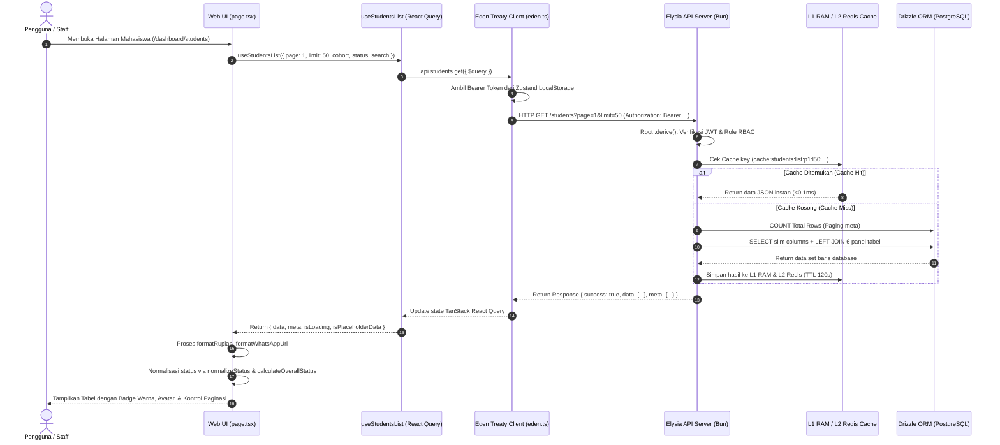

# Bagian 2: Alur Data, Logika Bisnis & Presentasi UI

Dokumen ini merupakan **Bagian 2** dari dokumentasi teknis sistem **Dashboard Nusadaya**, yang menjelaskan secara mendalam alur pengambilan data (*data fetching*), sistem caching dua lapis, kontrak API client-server, logika bisnis standarisasi status, siklus mutasi data, serta tata cara menampilkan data di antarmuka pengguna (UI).

---

## 1. Alur Pengambilan Data End-to-End (Data Fetching Flow)

Diagram urutan berikut mengilustrasikan bagaimana sebuah permintaan data diproses dari interaksi pengguna di peramban hingga data berhasil ditarik dari basis data PostgreSQL:



---

## 2. Mekanisme Caching Dua Lapis (Two-Tier Caching)

Untuk memastikan respons API berada di bawah 10ms dan mengurangi beban query ke database hingga 80%, sistem menerapkan **Two-Tier Cache Manager** di `apps/api/src/lib/cache.ts`:

```
Request API 
     │
     ▼
[ 1. Cek L1 In-Memory RAM Cache ] ──► (Hit: Return <0.1ms)
     │ (Miss)
     ▼
[ 2. Cek L2 Redis Cache ] ──────────► (Hit: Populate ke L1 & Return ~1ms)
     │ (Miss)
     ▼
[ 3. Query PostgreSQL via Drizzle ]
     │
     ▼
[ 4. Simpan ke L1 RAM + L2 Redis (TTL 120s) ] ──► Return JSON ke Klien
```

1. **L1 RAM (In-Memory Map)**:
   - Disimpan langsung di memori RAM proses Bun menggunakan struktur data JavaScript `Map<string, CacheEntry>`.
   - Waktu baca instan tanpa I/O jaringan (~0.01ms).
   - Dilengkapi interval pembersihan otomatis setiap 60 detik serta pembatasan jumlah kunci maksimal (1.000 entri).
2. **L2 Redis Cache**:
   - Jika data tidak ada di RAM lokal, sistem mencari ke Redis.
   - Apabila ditemukan di Redis, data di-cache ulang ke RAM lokal agar request berikutnya langsung dilayani dari L1.
3. **Invalidation Otomatis**:
   - Ketika ada pembaruan data, server memicu `cacheDel` dan `cacheInvalidatePattern("cache:students:list:*")` untuk membersihkan cache secara sinkron di L1 regex memory map dan L2 Redis SCAN cursor.

---

## 3. Komunikasi Client-Server & Kontrak Type-Safe

### 3.1 Injeksi Token & Sanitasi URL (`apps/web/src/lib/eden.ts`)
Frontend menggunakan **Eden Treaty** (`@elysiajs/eden`) yang mewarisi definisi tipe backend secara utuh tanpa perlu membuat interface duplikat:

```typescript
export function getToken(): string | null {
  try {
    const raw = localStorage.getItem("auth-storage");
    if (!raw) return null;
    const parsed = JSON.parse(raw);
    return parsed?.state?.token ?? null;
  } catch {
    return null;
  }
}

export const api = edenTreaty<App>(API_URL, {
  fetcher: async (url, options) => {
    const token = getToken();
    const headers = new Headers(options?.headers || {});
    if (token) headers.set("Authorization", `Bearer ${token}`);
    
    const finalUrl = cleanUrl(url); // Membersihkan parameter undefined/null/empty
    return fetch(finalUrl, { ...options, headers });
  }
});
```

### 3.2 State Server Pintar dengan React Query (`apps/web/src/hooks/useStudentsList.ts`)
- **`placeholderData: keepPreviousData`**: Tabel data tidak akan berkedip kosong (*no flickering*) saat user berganti nomor halaman atau memilih filter baru; data lama dipertahankan hingga data baru siap.
- **`staleTime: 10000` (10 detik)**: Mencegah request ganda yang tidak perlu saat komponen di-mount ulang.
- **`gcTime: 300000` (5 menit)**: Mempertahankan cache data di memori klien untuk navigasi halaman cepat.

---

## 4. Logika Bisnis & Standarisasi Status 4 Kategori

Seluruh data dari modul PMB, CRM, Finance, Akademik, PA, dan Magang dinormalisasi ke dalam **4 Kategori Status Standar** (`apps/web/src/utils/status.ts`):

| Status | Label | Indikator Visual | Kriteria Logika |
| :--- | :--- | :--- | :--- |
| **`ACC`** | Sudah ACC | Badge Hijau Emerald | Data panel telah divalidasi resmi dan disetujui oleh admin divisi terkait (`isAcc === true`). |
| **`AMAN`** | Aman / Selesai | Badge Hijau Terang | Seluruh indikator/tugas selesai 100%, namun belum ada tindakan approval formal admin. |
| **`PROSES`** | Sedang Proses | Badge Kuning / Oranye | Progres penyelesaian mahasiswa berada di rentang **> 30%** dan **< 100%**. |
| **`BUTUH_PERHATIAN`**| Butuh Perhatian | Badge Merah | Progres mahasiswa **$\le$ 30%**, atau terdapat kendala administratif / tunggakan / catatan disiplin. |

### Logika Agregasi Status Global (`calculateOverallStatus`)
Status keseluruhan mahasiswa dihitung berdasarkan prinsip **Hierarchy of Importance**:
1. Jika terdapat **minimal satu** panel berstatus `BUTUH_PERHATIAN`, maka status global menjadi **`BUTUH_PERHATIAN`** (Merah).
2. Jika tidak ada yang merah, namun ada minimal satu panel berstatus `PROSES`, status global menjadi **`PROSES`** (Kuning).
3. Jika seluruh 6 panel berstatus `ACC`, status global menjadi **`ACC`** (Hijau Tua).
4. Jika seluruh panel telah selesai (kombinasi `AMAN` dan `ACC`), status global menjadi **`AMAN`** (Hijau).

---

## 5. Alur Siklus Mutasi Data & Invalidation (Create / Update / Delete)

Ketika pengguna menyimpan formulir, menyetujui (ACC) berkas, atau mengunggah dokumen:

```mermaid
flowchart TD
    A[Staff Klik Simpan Form / Upload Bukti] --> B[Client Input Validation: Angka >= 0, File Type Check]
    B --> C[Eden Treaty / Native Fetch kirim PUT/POST ke API]
    C --> D[Elysia Route: Validasi Body Schema t.Object]
    D --> E[Database Transaction: db.transaction]
    E --> F[Update Tabel Data Mahasiswa / Panel Terkait]
    E --> G[Insert Audit Log ke tabel auditLogs]
    F & G --> H[Commit Transaksi PostgreSQL]
    H --> I[Cache Invalidation: cacheDel & cacheInvalidatePattern]
    I --> J[API Return Response: { success: true }]
    J --> K[Sonner Toast: toast.success 'Data Berhasil Disimpan']
    K --> L[React Query: Invalidate Queries / Auto Refetch]
    L --> M[UI Terupdate Otomatis Tanpa Reload Halaman]
```

### Aturan Integritas Data & Mutasi:
1. **Lapis Validasi Input Angka**: Seluruh input nominal wajib melewati sanitasi `Math.max(0, Number(val))` dan blokir karakter minus / notasi eksponensial di event keyboard.
2. **Transaksi Database Atomik**: Operasi hapus mahasiswa (`DELETE /students/:id`) atau mutasi multi-tabel dibungkus dalam `db.transaction(async (tx) => { ... })` sehingga jika salah satu relasi gagal, perubahan data dibatalkan penuh (*rollback*).
3. **Hard Delete & File Cleanup**: Penghapusan data transaksi (misal: penerima fee sharing) menghapus record di database sekaligus menghapus berkas PDF fisik dari filesystem melalui `unlink`.
4. **Audit Logging**: Setiap mutasi tercatat otomatis ke tabel `auditLogs` (merekam `userId`, `action`, `entity`, dan metadata perubahan).

---

## 6. Presentasi UI & Komponen Dinamis

### 6.1 Arsitektur Modular Multi-Panel
Pada halaman detail mahasiswa (`apps/web/src/app/dashboard/students/[id]/page.tsx`), tampilan dipecah menjadi komponen modular:
- **Panel Container Ringan (< 200 baris)**: Bertindak sebagai wrapper yang memegang state global, role permissions (`canEdit`), layout header, dan tab switcher.
- **Sub-Tab Mandiri**: Memegang state lokal formulir, interaksi tombol, dan request mutasi spesifik (misal: `TabKeuangan.tsx`, `TabFeeSharing.tsx`, `TabChecklist.tsx`, `TabSkemaKeuangan.tsx`).

### 6.2 Upload & Streaming Berkas PDF (`DocumentUpload.tsx`)
- Komponen reusable untuk seluruh 6 divisi.
- Menangani upload file langsung via `multipart/form-data`, menampilkan progress spinner, dan menyediakan tombol pratinjau (*preview*) dokumen PDF melalui iframe streaming terproteksi.

### 6.3 Helper Pemformatan Tampilan (`apps/web/src/utils/format.ts`)
- **Mata Uang**: Diformat ke Rupiah (`formatRupiah(val)` $\rightarrow$ `Rp 1.500.000`).
- **Nomor Telepon**: Diformat otomatis menjadi link WhatsApp langsung (`formatWhatsAppUrl(phone)` $\rightarrow$ `https://wa.me/628xxx`).
- **Tanggal & Waktu**: Diformat menggunakan locale `id-ID` dengan zona waktu lokal perangkat.

---

## 7. Rangkuman Best Practices & Pedoman Pengembangan

1. **Gunakan Named Exports**: Seluruh komponen React diekspor dengan format `export function ComponentName()`.
2. **Wajib Directive `"use client"`**: Diletakkan pada baris pertama di setiap komponen yang menggunakan React hooks (`useState`, `useEffect`, `useQuery`).
3. **Feedback UI Non-Blocking**: Selalu gunakan `toast` dari `sonner` — dilarang menggunakan dialog bawaan browser seperti `window.alert` atau `window.confirm`.
4. **Pecah File Besar**: Komponen dengan panjang baris melebihi ±500 baris wajib dipecah menjadi sub-komponen tab terpisah.
5. **Cek Tipe TypeScript**: Selalu jalankan `bun run tsc --noEmit` di backend maupun frontend setelah melakukan perubahan kode untuk memastikan keabsahan tipe data.

---

> Kembali ke ikhtisar arsitektur dan struktur sistem pada **[Bagian 1: Arsitektur Sistem, Ekosistem Teknologi & Struktur Berkas](file:///c:/.PROJECT/dashboard-nusadaya/docs/01-arsitektur-dan-struktur-sistem.md)**.
